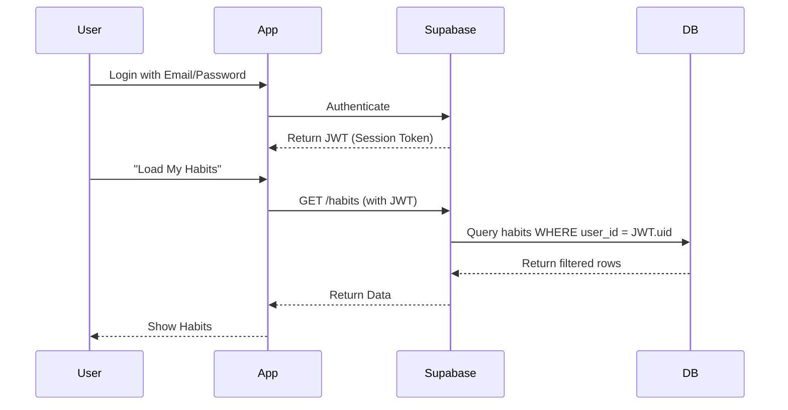

# ⚙️ Technical Deep Dive & Architecture

> This document provides an under-the-hood look at **Vale.OS**. It explains the design choices, the technology stack, and how specific features were implemented.

## 🏗 System Architecture

The application follows a **Serverless / Client-Heavy** architecture. We leverage Supabase for all backend needs (Auth, DB, Realtime) while keeping the UI snappy via React.

```mermaid
graph TD
    User[👤 User] -->|Interacts| UI[💻 React UI (Vite)]
    
    subgraph Frontend [Frontend Layer]
        UI -->|State Mgmt| RQ[React Query Cache]
        UI -->|Global State| Context[React Context (Theme/Auth)]
        RQ -->|Fetch/Mutate| SupabaseClient[Supabase JS Client]
    end
    
    subgraph Backend [Supabase PaaS]
        SupabaseClient -->|HTTPS| API[Supabase API gateway]
        API -->|Auth| Auth[GoTrue (Auth Service)]
        API -->|Data| DB[(PostgreSQL Database)]
        DB -->|Security| RLS[Row Level Security Policies]
    end
```

### 🔐 Auth Flow & Security
Security is handled via **Row Level Security (RLS)** in PostgreSQL. This means the frontend *can* theoretically try to request anything, but the database will only return data that belongs to the `auth.uid()`.



---

## 🧩 Tech Stack Decisions

### Why **React Query** over Redux?
In a data-heavy app like this, 90% of our "state" is actually **server state** (habits, logs, goals).
- **Redux**: Great for complex *client* state, but requires boilerplate for fetching/caching.
- **React Query**: Handles caching, deduplication, background refetching, and optimistic updates out of the box.

### Why **Shadcn/UI**?
We need total control. Component libraries like MUI are hard to customize deeply. Shadcn provides **Accessible Primitives** (via Radix UI) that we copy into our code.
- **Styling**: Tailwind CSS classes.
- **Behavior**: Radix UI (Headless).
- **Modification**: We own the code in `src/components/ui`.

---

## 📂 Core Data Models

Key tables in Supabase:

| Table Table | Description | Key Relationships |
| :--- | :--- | :--- |
| `users` | Profile data (avatars, xp, level) | Links to `auth.users` |
| `habits` | Definition of habits (title, frequency) | `user_id` |
| `habit_logs` | Daily completion records | `habit_id`, `date` |
| `goals` | Long term macro goals | `user_id` |

---

## 🚀 Performance Optimizations

1.  **Code Splitting**: Routes are lazy-loaded via React Router.
2.  **Optimistic Updates**: When you check a habit, the UI updates *instantly*. If the API fails, it rolls back.
3.  **Memoization**: Heavy charts (Heatmaps) are memoized with `useMemo` to prevent re-rendering on unrelated state changes.

---

## 🐛 Troubleshooting Common Issues

### "Supabase Key Missing"
Ensure your `.env` file exists and has `VITE_SUPABASE_URL` and `VITE_SUPABASE_ANON_KEY`.

### "Typescript Errors on Build"
Run `npx supabase gen types typescript --project-id "your-id" > src/lib/database.types.ts` to sync local types with your remote DB schema.
